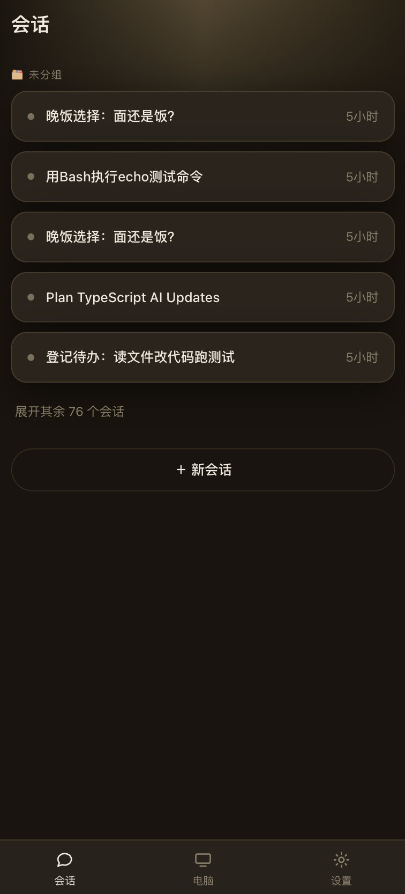
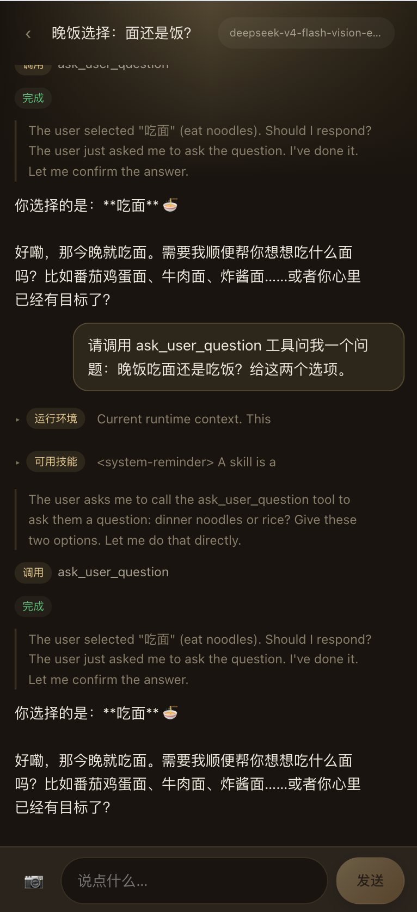
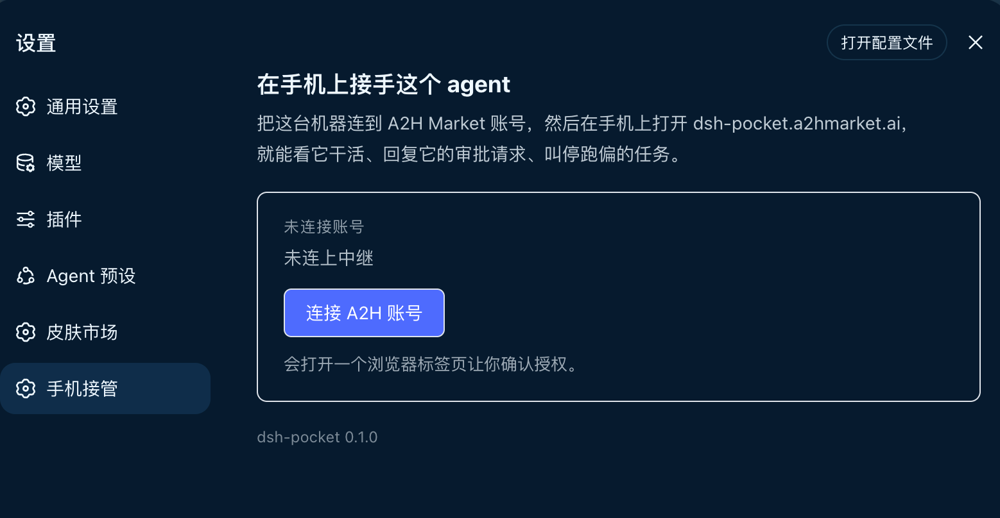
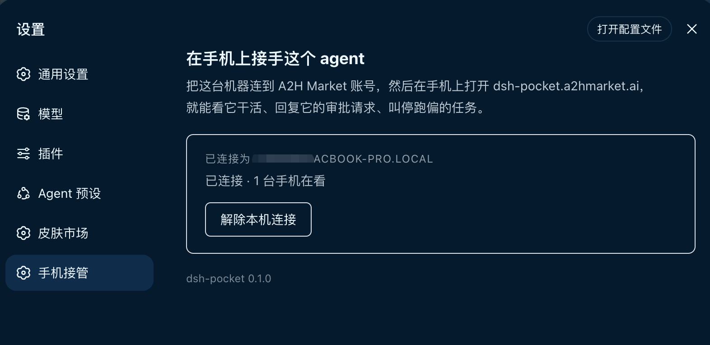
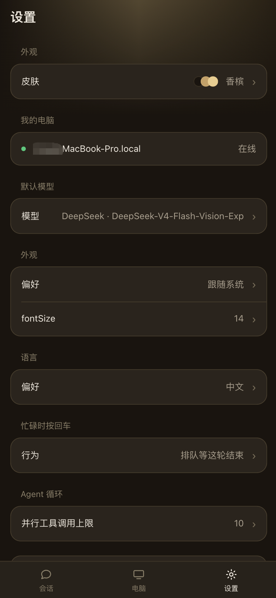

<h1 align="center">DSH Pocket</h1>

<p align="center">
  <strong>Put <a href="https://github.com/deepseek-ai/deepseek-harness">DeepSeek Harness</a> in your pocket — watch and steer the agent on your computer from a phone browser.</strong><br>
  Approve a tool call, answer a question, send a message, stop a turn — without walking back to your desk.
</p>

<p align="center">
  <a href="https://dsh-pocket.a2hmarket.ai"><strong>dsh-pocket.a2hmarket.ai</strong></a>
  — open it on your phone, sign in, and your computer is there
</p>

<p align="center">
  <a href="https://github.com/keman-ai/dsh-pocket"></a>
  <a href="https://github.com/keman-ai/dsh-pocket/releases"></a>
  <a href="LICENSE"></a>
</p>

<p align="center">
  <b>English</b> · <a href="README.zh-CN.md">简体中文</a>
</p>

<p align="center">
  <b>If this is useful to you, a Star goes a long way</b>
</p>

<table>
  <tr>
    <td width="50%" valign="top">
      
    </td>
    <td width="50%" valign="top">
      
    </td>
  </tr>
  <tr>
    <td valign="top">
      <h3>Every session, in your pocket</h3>
      <p>The sessions running on your computer, grouped the way dsh groups them. Tap one to open it, or start a new one from here.</p>
    </td>
    <td valign="top">
      <h3>Watch and steer</h3>
      <p>Output streams live — reasoning and answer. Approve a tool call, send a message or a <strong>photo</strong>, stop a turn. The context dsh injects each turn folds away, so the conversation is what you read.</p>
    </td>
  </tr>
</table>

## Get started

**1 · Install** into the **web** profile and start dsh:

```sh
dsh plugin --profile web add -w github:keman-ai/dsh-pocket
dsh --profile web
```

`-w` is required — the profile is a pnpm workspace root. From a source checkout, use `pnpm dsh`.

**2 · Turn it on.** Pocket ships off by default — attaching a shell-capable machine to a public relay is your call. Enable it in `$DSH_HOME/profiles/web/cordis.patch.yml` and restart dsh:

```yaml
- id: pocket
  config:
    enabled: true
```

**3 · Link an account.** In dsh, open **Settings → Pocket → Link an A2H account** and approve in the tab that opens. The machine then shows as online.

<table>
  <tr>
    <td width="50%" valign="top">
      
    </td>
    <td width="50%" valign="top">
      
    </td>
  </tr>
</table>

**4 · Open it on your phone.** Go to **[dsh-pocket.a2hmarket.ai](https://dsh-pocket.a2hmarket.ai)**, sign in with the same account, tap your computer, and pick a session. The signing key for approvals is delivered automatically — nothing to scan or copy.

## What you can do from the phone

- **Watch** the agent's output stream live — its reasoning as well as its answer, so you can tell thinking from stuck.
- **Approve or refuse** a tool call the instant it asks. The turn is blocked waiting on you; a tap releases it.
- **Answer its questions** when it stops to ask one.
- **Send a message**, or **snap a photo** and hand it straight to the agent — something you cannot do from the desk.
- **Stop** a turn that has gone the wrong way.
- **Switch the model**, **edit preferences** (language, appearance, default model, agent loop), and **pick a skin** — all without walking back.

Injected context — the runtime snapshot and the skill catalog dsh adds to every turn — is folded away, so the actual conversation is what fills the screen.

<p align="left">
  
</p>
<p align="left">
  <sub>Skin, default model, language and agent-loop preferences — all editable from the phone</sub>
</p>

## Security

- **Off by default.** Nothing connects until you switch it on and link an account.
- **No inbound port.** Both the plugin and the phone dial *out* to the relay, so reaching your machine needs no port forwarding, no tunnel, no NAT traversal — Pocket opens nothing new for anyone to connect to.
- **Frames pass through the relay, not into it.** Session frames are forwarded in memory; their content is neither stored nor logged.

Linking a machine lets any phone signed into that account approve commands on it. Treat the account as you would an SSH key.

## Requirements

| Dependency | Requirement | What happens without it |
|---|---|---|
| **DeepSeek Harness** | `0.1.2+` | Earlier versions lack the per-domain controllers and settings section this plugin uses, so it cannot mount |
| **profile** | The **web** profile | The linking UI and Settings panel are client UI; headless / tui bundles have no web app, so the plugin never activates |
| **Node.js** | `>= 22.19` | dsh's own floor; the relay link uses Node's global `WebSocket`, so the host half carries no runtime dependency |
| **account** | An A2H Market account | Linking is per-account, and the phone signs in with the same one |
| **Network** | `account.a2hmarket.ai`, `dsh-pocket.a2hmarket.ai`, and the relay (`api-prod.a2hmarket.ai`) | All connections are outbound; the machine never listens |

## Development

```sh
pnpm install
pnpm run check   # types
pnpm run test    # node --test
pnpm run build   # lib/index.js + lib/client.js
```

Install into a profile with pnpm's `link:` (not `file:`, which copies the package and hides later rebuilds):

```sh
cd ~/.dsh/profiles/<name> && pnpm add -w link:/path/to/dsh-pocket
```

`lib/` is committed on purpose — git installs run no build step — so run `pnpm run build` and commit it with your change.

The harness types in `types/dsh.d.ts` are transcribed by hand — the `@deepseek-ai/dsh-client-*` chain is not fully published, and these modules are external at runtime anyway. Declare only what is used, and check there first when the host errors.

## Related

| | |
|---|---|
| [dsh-pocket.a2hmarket.ai](https://dsh-pocket.a2hmarket.ai) | The phone frontend. Open it on your phone and sign in |
| [dsh-skin-market](https://github.com/keman-ai/dsh-skin-market) | Sibling plugin: search and install dsh skins without leaving the browser |

## License

[MIT](LICENSE) © 2026 Science Roam Limited

---

<p align="center">
  <sub>If this is useful to you, a Star goes a long way</sub>
</p>
